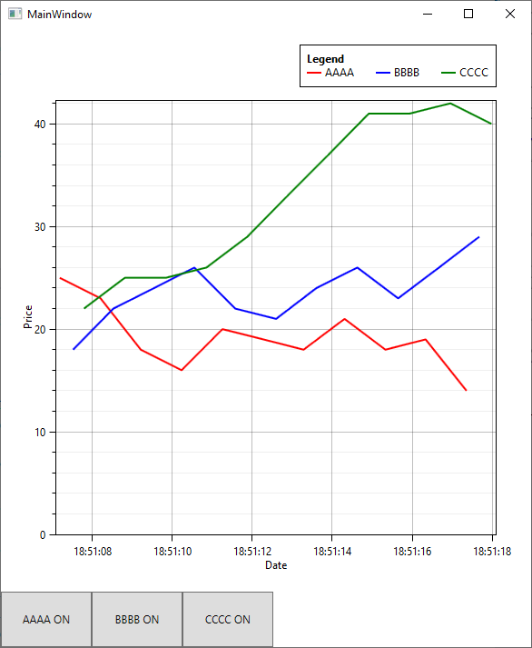

# DEMO: Akka.NET Deployment in a WPF desktop app

This project demonstrates how to intergrate [Akka.NET](https://getakka.net/)
in a WPF desktop app. 
As use case it realises an stock market monitoring scenario.

The code is a slightly modified and updated version from the Pluralsight course [Building Reactive Concurrent WPF Applications with Akka.NET](https://www.pluralsight.com/courses/akka-dotnet-building-reactive-concurrent-wpf-applications).

The chart shows simulated real-time prices of (fake) stocks:




## ActorSystem-UI Bridge
The actors `ButtonActor` and `LineChartingActor` play the
role of a **brige** between the GUI and Akka.NET ActorSystem: 
they communicate with the ActorSystem and update GUI controls.

### Problem
Actors normally run on different thread than UI thread.
If you try to update an UI control from within an actor you
will get:
```
System.InvalidOperationException: 'The calling thread cannot access this object because a different thread owns it.'
```
To enable an actor to update GUI controls create it
with `Props.WithDispatcher("akka.actor.synchronized-dispatcher")` e.g.:
```
actorSystem.ActorOf(Props.Create(() =>
                                    new ButtonActor(stocksCoordinatorActorRef, 
                                                    this.AAAA, 
                                                    new StockSymbol("AAAA", OxyColors.Red)))
                         .WithDispatcher("akka.actor.synchronized-dispatcher"))
```

The button actor can now update UI button (System.Windows.Controls.Button):
```
_button.Content = $"{_stockSymbol} ON";
```


## Dependency Injection
`App.xaml.cs` registers services for dependency injection.

To create an actor with dependencies use 
`Akka.DependencyInjection.DependencyResolver.For(actorSystem).Props(...)`


## Actor instantiation(solid lines) and flow of messages(dotted lines) between actors.
All actor classes in code are suffixed with `...Actor`. 
For brevity all suffixes in this diagram are omitted.


Note: Install [Markdown Editor](https://marketplace.visualstudio.com/items?itemName=MadsKristensen.MarkdownEditor2)
extension in Visual Studio to view [Mermaid](https://mermaid-js.github.io/mermaid) diagram as graphic.
